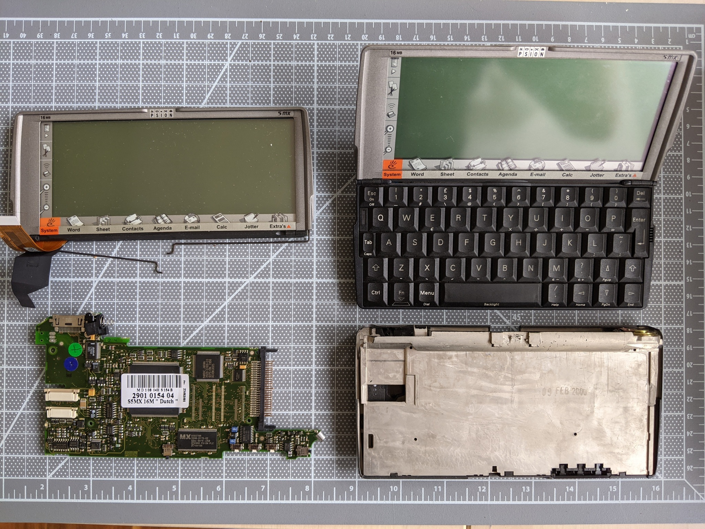
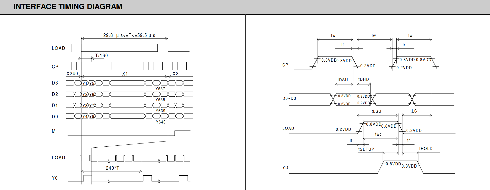

# Raspberry Pi for the Psion MX series

The [Psion 5 MX](https://en.wikipedia.org/wiki/Psion_Series_5) was a
PDA manufactured in 1999 that had a decent physical keyboard in a clamshell
with a really unique sliding design that counterbalanced it.
You could buy a modern [Gemina PDA](https://www.www3.planetcom.co.uk/gemini-pda)
that has a color screen and a decent processor, or you could try to
fit a Pi Zero W and interface FPGA into the twenty year old gadget.

## Screen module

The LCD is 640x240 with four levels of gray, a Hitachi SP14H001-T1A,
but no datasheet has been found for it.  The [Hitachi SR16H005](datasheets/SR16H005.pdf) has a similar pinout, and the SR14Q001 has more analog power inputs.

### Pinout

Probing the [26-pin 0.5mm FPC connector](https://www.digikey.com/en/products/detail/amphenol-icc-fci/F32R-1A7H1-11026/11564654)
finds a similar four-bit wide data path, along with pins for the touch screen:

| Pin | Function |
| -|- |
|  1 | Digitizer X, idle 0.0V, analog pulses |
|  2 | Digitizer X, idle 3.3v, roughly every 20 ms |
|  3 | Digitizer Y, idle 3.3V, two pulses at a time |
|  4 | Digitizer Y, idle 0.0V, differential pairs? |
|  5 | GND |
|  6 | 3.3V (Digitizer power?) |
|  7 | LCD Bias voltage +20.0V |
|  8 | LCD Bias voltage -15V min contrast, -20V max contrast |
|  9 | 2.6V Unknown function? |
| 10 | 1.1V Unknown function? |
| 11 | GND |
| 12 | `Load`? 1.4 usec pulse every 59.6 usec |
| 13 | `CP` clock at 2.8 MHz |
| 14 | GND |
| 15 | Data at 2.8 Mhz |
| 16 | Data at 2.8 Mhz |
| 17 | Data at 2.8 Mhz |
| 18 | Data at 2.8 Mhz |
| 19 | GND |
| 20 | `Frame`? 60 usec pulse every 68 Hz |
| 21 | 3.3V (LCD power?) |
| 22 | 706 Hz square wave, 50% duty cycle. Not connected on the FPC? |
| 23 | GND |
| 24 | Backlight voltage |
| 25 | GND (But not connected on the FPC) |
| 26 | Backlight voltage (~70V?) |

The probed pinout matches the block diagram for the Hitachi module.
Four data pins, a high speed pixel clock, a latch roughly every 640/4 clocks,
and a frame roughly every 240 latches.

### Interface

640x240 is 153600 pixels, sent four in parallel, or 38400 clocks
per frame.  With the measured 2.8 MHz clock, that is 52 frames
per second for monochrome, or 26 frames per second with the four
levels of gray.

The display claims it can do 4 MHz clock, which would allow another
bit per pixel at roughly the same frame rate, for eight shades of gray.
The up5k has 1 megabit of block ram for the frame buffer, so it can
store four bits per pixels (614 kbits).

## Keyboard

[RasmusB built a Psion keyboard interface](https://github.com/RasmusB/USB-Keyboard-Adapter)
which documents the pinout and 12x8 scan matrix.  This has not yet been verified.

### Pinout

The keyboard conncetor is a 22-pin 0.5mm FPC similar to
[TE Connectivity AMP Connectors 2-1734839-2](https://www.digikey.com/en/products/detail/te-connectivity-amp-connectors/2-1734839-2/1860478).

| Pin | Function |
| -|- |
| 1 | NC |
| 2 | Col 9 |
| 3 | Col 12 |
| 4 | Col 11 |
| 5 | Col 10 |
| 6 | Col 8 |
| 7 | Col 7 |
| 8 | Col 3 |
| 9 | Col 4 |
| 10 | Col 5 |
| 11 | Col 6 |
| 12 | Col 2 |
| 13 | Row 3 |
| 14 | Row 4 |
| 15 | Row 5 |
| 16 | Col 1 |
| 17 | Row 2 |
| 18 | Row 6 |
| 19 | Row 7 |
| 20 | Row 8 |
| 21 | Row 1 |
| 22 | NC |

### Scan matrix

|    | 1 | 2 | 3 | 4 | 5 | 6 | 7 | 8 |
|   -| - | - | - | - | - | - | - | - |
|  1 |   | 1 | 7 | Q | U | Tab | H | Z |
|  2 | Space | 2 | 8 | W | I | A | J | X |
|  3 | Up | 3 | 9 | E | O | S | K | C |
|  4 | , | 4 | 0 | R | P | D | M | V |
|  5 | Left | 5 | Back | T | L | F | . | B |
|  6 | Right | 6 | \` | Y | Enter | G | Down | N |
|  7 | LShift | | | | | | |
|  8 | | | | | | | | RShift |
|  9 | | | | | | Ctrl | | |
| 10 | | | | | | | Fn | |
| 11 | | | | | Menu | | | |
| 12 | | | | Esc | | | | |

## FPGA interface

* 20 Psion keyboard
* 8 Psion LCD
* 3 Psion digitizer
* 5 Psion switches
* 1 Psion keyboard LED
* ? charge pump PWMs (-17 V LCD bias, +70 V backlight)
* 4 Pi SPI display
* 2 Pi serial console
* ? Pi to FPGA SPI programming

* Battery interface?
* Charger port?
* External connectors?
* CF port?
* IR port?
* Speaker?
* Mic?

up5k has ~30 available IO, so the keyboard takes many of them. Maybe bridge 7-8 so that they
use only one input?  Would this cause problems with multiple modifiers?

